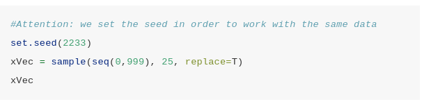
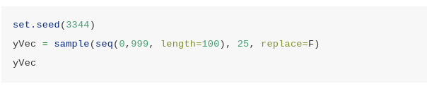
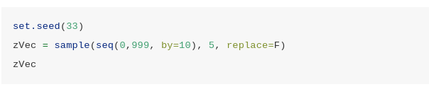

# Comandos básicos para programação com `R`

## Laboratório de Exercícios 1

### Exercício 1

1. Calcule $exp\left(3 - \dfrac{4}{5}\right) + \dfrac{\sqrt{3 + 2^5}}{4 - 7 \cdot \log{(10)}}$.

    **Resp.:**
    
    ```{r}
    exp(3 - 4/5) + (sqrt(3 + 2^5))/(4 - 7 * log(10))
    ```


2. Crie o vetor chamado `x` que contém os seguintes valores $\left(10, \log{(0,2)}, 6/7, \sqrt{54}, -0,124\right)$.

  * Encontre o comprimento de `x`.
  * Quais elementos de `x` estão entre 0 (incluído) e 1 (excluído)? Calcule também a contagem absoluta correspondente e a frequência relativa (proporções)?
  * Quais elementos de `x` são negativos? Substitua-os pelo mesmo número em valor absoluto.
  * Extraia de `x`o 2º e o 4º valor e salve-os em um novo vetor chamado`y`. Calcule $y + \sqrt{(\exp{(-0,4)})}$.
  
    **Resp.:** 
    ```{r}
    x <- c(10, log(0.2), 6/7, sqrt(54), -0.124)
    x
    ```

  * O comprimento do vetor `x` é igual a `r length(x)`.
    
  * Elementos de `x` que estão entre 0 (incluído) e 1 (excluído).
    ```{r}
    x1 <-  x[(x >=0) & (x < 1)]
    x1
    n1 <-  length(x1)
    n <- length(x)
    p <-  n1/n
    ```
    
    Existe `r n1` elemento satisfazendo essa condição, o que corresponde a `r round(100*p, 2)`% do total de elementos do conjunto `x`.
  
  * Elementos negativos de `x`.
    ```{r}
    x[x<0]
    ```
  
    As posições dos elementos negativos de `x`são:
    ```{r}
    negative_index <- which(x %in% x[x<0])
    negative_index
    ```
    Substituição dos elementos negativos pelos respectivos valores absolutos.
    ```{r}
    x[negative_index] <- abs(x[negative_index])
    x
    ```
    
  * Segunto e quarto elementos de `x`
    ```{r}
    y <- x[c(2, 4)]
    y
    y + sqrt(exp(-0.4))
    ```
  

  
### Exercício 2

1. Leia as páginas de ajuda das funções `sample` e `seq`.

  

2. Execute as seguintes linhas de código e tente entender o que está acontecendo.

```{r, fig.align='center', echo=FALSE, out.width="80%"}

```
    
  **Resp.:**
```{r}
set.seed(2233)
xVec <- sample(seq(0, 999), 25, replace = TRUE)
xVec
  ```
  


```{r, fig.align='center', echo=FALSE, out.width="80%"}

```
  **Resp.:**
  
```{r}
set.seed(3344)
yVec <-  sample(seq(0,999, length = 100), 25, replace = FALSE)
yVec
```
  

```{r, fig.align='center', echo=FALSE, out.width="80%"}

```

  **Resp.:**
```{r}
set.seed(33)
zVec <-  sample(seq(0, 999, by=10), 5, replace = FALSE)
zVec
```
  

3. Calcule algumas estatísticas resumidas para os três vetores.

  **Resp.:**
```{r}
estatisticas <- function(x){
  return(
    list(
      "length"=length(x),
      "mean"=mean(x),
      "median"=median(x),
      "sd"=sd(x)
    )
  )
}
```

```{r}
estatisticas(xVec)
```
```{r}
estatisticas(yVec)
```
  
```{r}
estatisticas(xVec)
```
  

4. Selecione os valores em `yVec` maiores que 600.

  **Resp.:**
  
```{r}
yVec[yVec > 600]
```


5. Selecione os valores em `yVec`que estão entre 600 e 800 e salve-os em um novo valore chamado `yVec_sel1`. Escolha os valores em `yVec`maiores que 600 ou menores que 800 e salve-os em um novo vetor chamado `yVec_sel2`. Qual é o comprimento de `yVec_sel1` e `yVec_sel2`?

  **Resp.:**
  
```{r}
yVec_sel1 <- yVec[(yVec > 600) & (yVec < 800)]
yVec_sel1

yVec_sel2 <- yVec[(yVec > 600) | (yVec < 800)]
yVec_sel2
```

```{r}
length(yVec_sel1)
length(yVec_sel2)
```


6. Quais são os valores em `xVec` que correspondem aos valores em `yVec` que são maiores que 600? (Por correspondência, dizemos que eles têm as mesmas posições).

**Resp.:**

```{r}
xVec[which(yVec > 600)]
```


7. Calcule a soma e a diferença dos 5 primeiros elementos dos 2 vetores. Dica: para indexar os 5 primeiros elementos, use `1:5`.

  **Resp.:**
```{r}
xVec[1:5] + yVec[1:5]

xVec[1:5] - yVec[1:5]
```
  

8. Para `xVec` calcule a seguinte fórmula $\dfrac{\sum_ {i = 1}^n \left(x_i - \bar{x}\right)^2}{n}$, onde $n$ é o comprimento do vetor e $\bar{x}$ é a média do vetor. O resultado é igual ao obtido com `var`? Por quê? 

**Resp.:**

```{r}
xVar <- sum((xVec - mean(xVec))^2)/length(xVec)
xVar

xVar2 <- var(xVec)
xVar2
```

A fórmula dada no enunciado do problema calcula a variância populacional enquanto a função `var` do base R calcula a variância amostral. A diferença entre as duas expressões é que para a variáncia amostral o denominador da fração é igual a $n - 1$ e não $n$.

9. Para `xVec`calcule a seguinte fórmula $\dfrac{\sum_{i=1}^n |x_i - Me| }{n}$, onde $n$ é o comprimento do vetor e $Me$ é a mediana do vetor.

  **Resp.:**
  
```{r}
sum(abs(xVec - median(xVec)))/length(xVec)
```


### Exercício 3

Considere o seguinte modelo $$Y = \beta_0 + \beta_1 X + \varepsilon$$

onde $\beta_0 = 2$, $\beta_1 = 0,3$ e $\varepsilon$ é uma distribuição normal com média 0 e variância 1. 

1. Considerando uma sequência de valores para $X$ entre 0 e 10, simule 200 valores para $Y$.

  **Resp.:**
```{r}
beta_0 <- 2
beta_1 <- 0.3

X <- seq(from=0, to=10, length=201)
eps <- rnorm(201, mean = 0, sd = 1)
Y <- beta_0 + beta_1 * X
```


2. Traçar os valores simulados.
  **Resp.:**
```{r}
df <- data.frame(X, Y, eps)

df %>%
  ggplot() +
    geom_line(aes(x=X, y=Y), colour="blue")+
    geom_point(aes(x=X, y=Y+eps))
```


